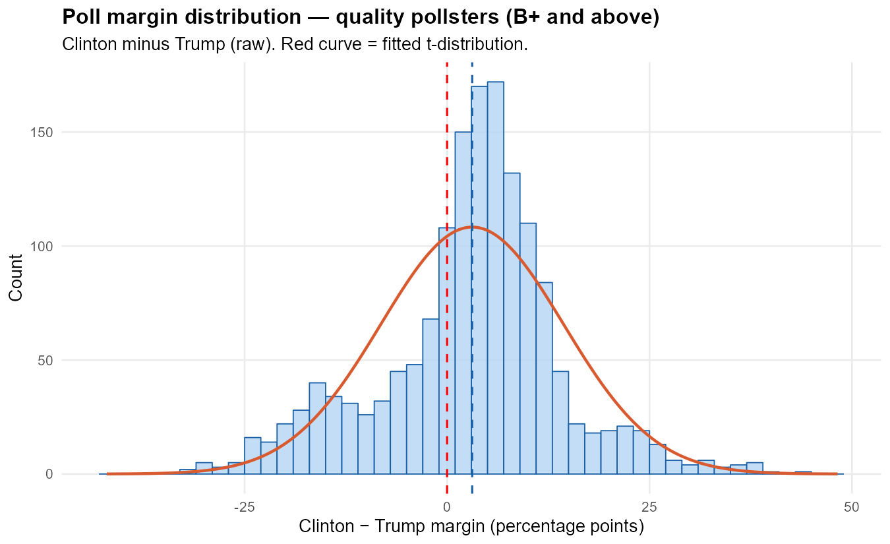
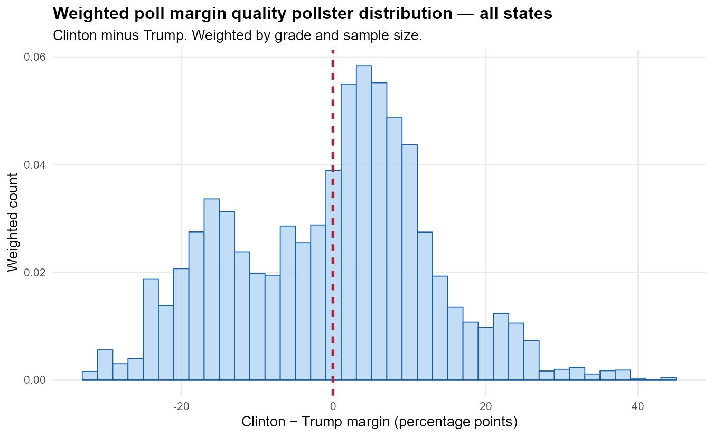
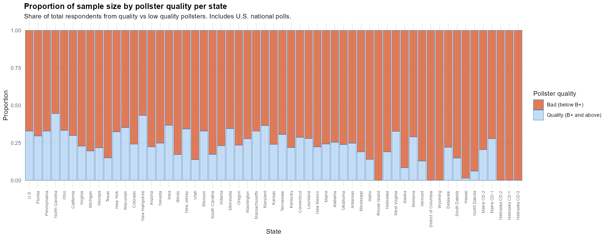

# 2016 U.S. Presidential Election Polling Bias — Findings

**Data:** Presidential General Election Polls  
**Access:** `dslabs::polls_us_election_2016`  

---

## 1. Margin Definition

All analysis uses the raw Clinton − Trump margin (percentage points).  
- Positive values → Clinton leading  
- Negative values → Trump leading  
- Zero is the electoral threshold that matters

---

## 2. Unweighted Means (Raw Poll Averages)

| Subset | Mean Margin |
|--------|------------|
| All polls | +2.16 |
| Quality pollsters (B+ and above) | +3.10 |
| Low quality pollsters (below B+) | +1.62 |

At face value, every subset pointed to a Clinton lead. Quality pollsters actually showed a *larger* Clinton advantage than low quality pollsters unweighted, which runs counter to the narrative that better polls were more accurate.

---

## 3. Weighted Means (Grade × Sample Size Weighting)

Each poll is weighted by:  
`weight = grade_weight / samplesize`  
Normalized so all weights sum to 1.

Grade weights: A+ = 1.0, A = 0.75, A− = 0.5, B+ = 0.25, B = 0.125, B− = 0.1, C+ = 0.075, C = 0.05, C− = 0.025, D = 0.0125

| Subset | Weighted Mean Margin |
|--------|---------------------|
| All polls | +0.47 |
| Quality pollsters (B+ and above) | **−0.16 (Trump)** |
| Low quality pollsters (below B+) | +2.15 |

**Key finding:** Once pollster quality and sample size are accounted for, the quality-weighted mean flips negative — pointing to a near toss-up or slight Trump edge. This is consistent with the actual election outcome. The unweighted quality mean of +3.10 was being inflated by small, high-grade polls showing large Clinton leads. When downweighted by sample size, the signal reverses.

Low quality polls barely moved when weighted (+1.62 → +2.15), suggesting their large sample sizes were artificially inflating Clinton's lead in the raw aggregate.

---

## 4. Sample Size Distribution

| Subset | Mean Sample Size | Median Sample Size |
|--------|-----------------|-------------------|
| All polls | 1,148 | 772 |
| Quality pollsters | 795 | 698 |
| Low quality pollsters | 1,350 | 800 |

Low quality pollsters ran systematically larger samples than quality pollsters. This is the core mechanism behind the weighting story: in a naive (unweighted) average, large low-quality polls dominate the signal. Dividing by sample size corrects for this.

---

## 5. Voter Population Type (lv / rv / v / a)

The boxplot analysis (Figures 04–06) shows a clear spectrum from most to least screened:

- **a (adults):** Median clearly below zero — Trump favored. Broadest, least screened sample.
- **lv (likely voters):** Median just above zero, straddles the threshold. Largest variance and extreme outliers.
- **rv (registered voters):** Median above zero, Clinton more clearly favored.
- **v (voters):** Near toss-up.

Among quality pollsters specifically, the adult polls showed a Clinton margin around −15 points — a stark signal that unscreened samples were unfavorable to Clinton. The likely voter spread was enormous, consistent with pollsters using very different likely voter screens.

---

## 6. Poll Margin Over Time (LOESS)

**All pollsters (Figure 07):** Clinton maintained a narrow positive margin throughout the campaign, converging toward zero by Election Day. The LOESS smoother barely crossed above zero and finished essentially at the threshold.

**Quality pollsters (Figure 08):** A clearer arc — Clinton peaked around April–May 2016 at roughly +8 points, then declined steadily through the summer and fall, crossing below zero in the final weeks. This is the most honest picture of the race.

**Low quality pollsters (Figure 09):** A nearly flat, near-zero line throughout — these polls showed almost no momentum signal and essentially no lead for either candidate at any point. This suggests low quality pollsters were contributing noise rather than signal to the aggregate.

---

## 7. State-Level Sample Distribution (Figures 13–15)

**Total sample size (Figure 13 with U.S., Figure 14 without):**  
U.S. national polls dominated by volume. Among states, Florida, Pennsylvania, North Carolina, and Ohio led — the classic 2016 battleground map. Non-competitive states had minimal polling coverage.

**Proportion of quality vs low quality polling by state (Figure 15):**  
Across virtually every state, 65–95% of total respondents came from low quality pollsters. Florida and Pennsylvania had the highest quality proportions (~30–45%), reflecting their status as top-tier battlegrounds attracting premium pollsters. Many states had essentially zero quality polling — Wyoming, North Dakota, and Nebraska congressional districts were near 100% low quality.

This chart is the visual justification for the weighting scheme. A naive unweighted aggregate is functionally a low-quality-pollster average, with a small quality signal buried inside it.

---

## 8. Summary Interpretation

The 2016 polling miss was not random noise. A systematic pattern emerges:

1. Low quality pollsters ran large samples that skewed Clinton
2. High quality pollsters with large samples pointed to a near-toss-up
3. The volume of low-quality polling swamped the signal from quality polls in unweighted aggregates
4. Standard poll averages reported a Clinton lead of ~2–3 points; a properly weighted quality-only average pointed to essentially 0

The weighted quality mean of −0.16 is not a confident Trump prediction, but it correctly identifies the race as too close to call — which the unweighted average of +3.10 did not.

---

## Key Figures

**Quality pollster margin distribution (unweighted)**  

**Quality pollster margin distribution (weighted by grade and sample size)**  

**Proportion of quality vs low quality polling by state**  

---

## References

- Irizarry, R.A. and Gill, A. (2021). *dslabs: Data Science Labs*. R package version 0.7.4. https://CRAN.R-project.org/package=dslabs  
