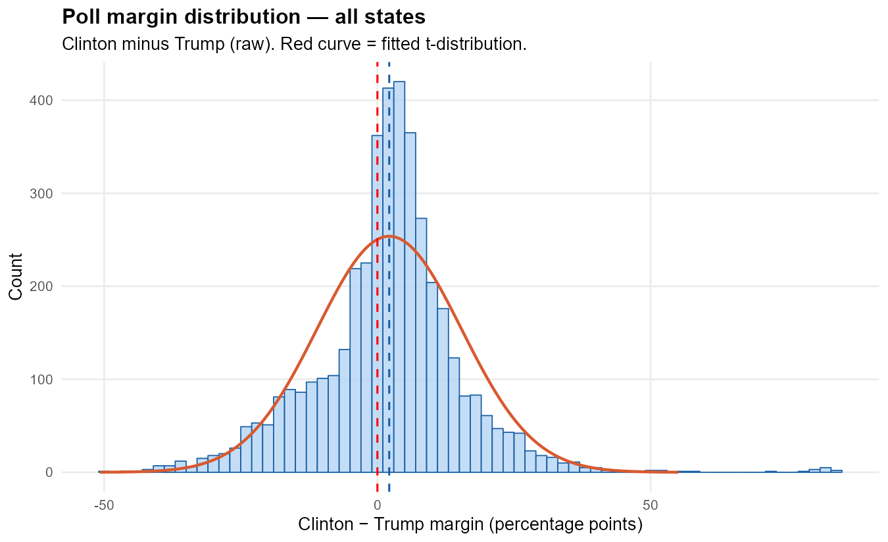
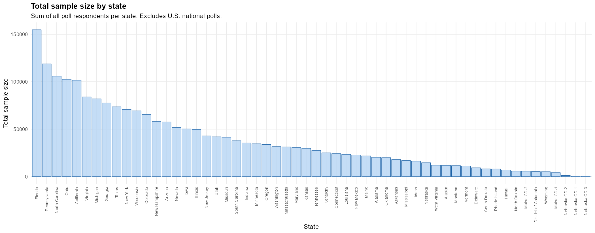
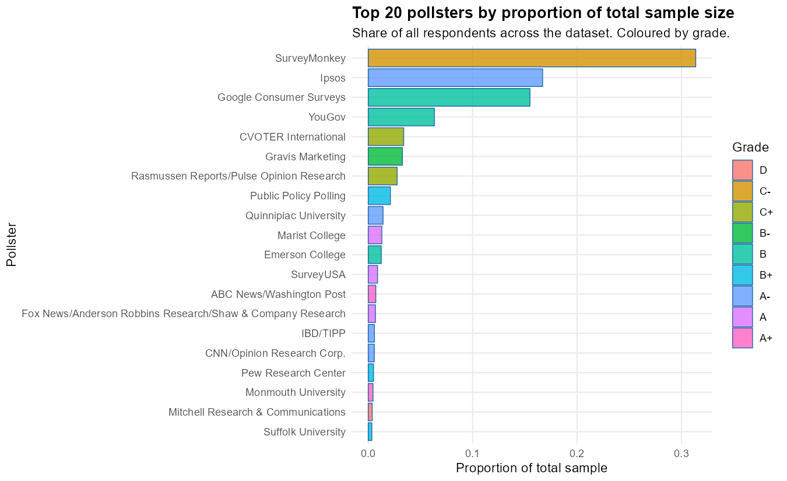
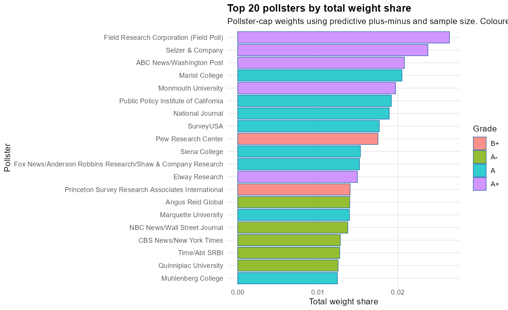
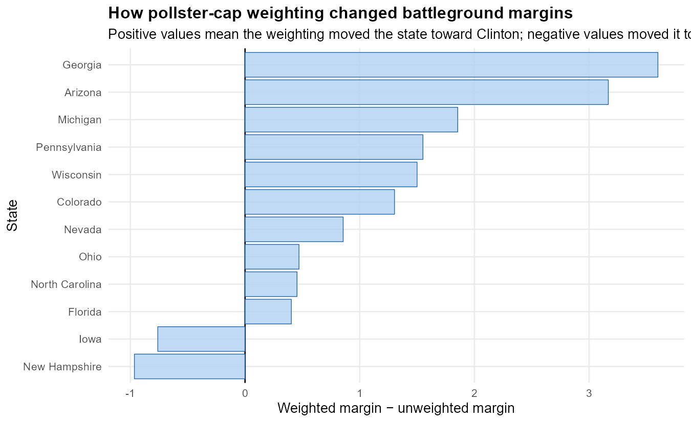

# 2016 U.S. Presidential Election Polling Weights

This project explores how different weighting choices change the interpretation of 2016 U.S. presidential election polls. The goal is not to build a full election forecast. Instead, the project asks a narrower methodological question:

> If pollsters are weighted by historical predictive quality and sample size, does the 2016 polling picture move closer to Trump, or further toward Clinton?

The answer from this experiment is surprising: the pollster-cap weighting scheme gives sensible-looking influence to high-quality pollsters, but it pushes the pooled polling average further toward Clinton and often shifts battleground states further toward Clinton as well.

---

## Data

The polling dataset comes from `dslabs::polls_us_election_2016`.

The pollster-quality data comes from FiveThirtyEight's pollster ratings file, specifically the `Predictive.Plus.Minus` variable.

All margins are measured as:

```text
Clinton margin = rawpoll_clinton - rawpoll_trump
```

Positive values indicate a Clinton lead. Negative values indicate a Trump lead.

---

## What is Predictive Plus-Minus?

FiveThirtyEight's pollster ratings are based on **Predictive Plus-Minus**, a pollster-quality metric designed to measure how much better or worse a pollster is expected to perform relative to an average pollster.

FiveThirtyEight describes Predictive Plus-Minus as depending on several components:

- simple polling error,
- how well other pollsters performed in the same races,
- methodological quality,
- and evidence of herding.

Lower values are better. Negative values indicate pollsters that are expected to perform better than average. Positive values indicate pollsters expected to perform worse than average.

---

## Weight Specification

The project uses a **pollster-cap weighting scheme**. The idea is to prevent high-frequency pollsters from dominating the dataset simply because they released many polls.

Each pollster first receives a total influence cap:

```text
pollster_cap_p = exp(-PredictivePlusMinus_p) * sqrt(mean_sample_size_p)
```

Then that pollster's cap is distributed across its own polls according to individual sample size:

```text
within_pollster_weight_i = sqrt(sample_size_i) / sum(sqrt(sample_size_j)) for polls j from the same pollster
```

The final raw poll weight is:

```text
raw_weight_i = pollster_cap_p * within_pollster_weight_i
```

Finally, all weights are normalized to sum to 1.

This specification does three things:

1. rewards historically stronger pollsters using FiveThirtyEight's Predictive Plus-Minus,
2. rewards larger samples with diminishing returns,
3. prevents high-volume pollsters from dominating the aggregate.

---

## Raw Polling Averages

| Subset | Unweighted Mean Margin |
|---|---:|
| All polls | Clinton +2.16 |
| Quality pollsters, B+ and above | Clinton +3.10 |
| Low-quality pollsters, below B+ | Clinton +1.62 |

All three unweighted averages point to Clinton. The higher-rated pollster subset actually shows the largest Clinton lead.

---

## Pollster-Cap Weighted Averages

| Subset | Pollster-Cap Weighted Mean Margin |
|---|---:|
| All polls | Clinton +4.80 |
| Quality pollsters, B+ and above | Clinton +6.41 |
| Low-quality pollsters, below B+ | Clinton +2.25 |

This is the central result of the weighting experiment. The new weighting scheme does **not** correct the 2016 polling miss toward Trump. Instead, it pushes the aggregate further toward Clinton.

This does not mean the formula is mechanically broken. The top-weighted pollsters are generally high-quality pollsters. The issue is that high-quality pollsters in this dataset often had more Clinton-favourable margins, especially in national polls and strongly Democratic states.

---

## Sample Size Patterns

| Subset | Mean Sample Size | Median Sample Size |
|---|---:|---:|
| All polls | 1,148 | 772 |
| Quality pollsters | 795 | 698 |
| Low-quality pollsters | 1,350 | 800 |

Low-quality pollsters tended to have larger samples in this dataset. That matters because simple sample-size weighting alone can give a lot of influence to lower-rated, high-volume pollsters.

---

## Pollster Influence

The project compares two different notions of influence:

1. **sample share**, or which pollsters interviewed the most total respondents;
2. **pollster-cap weight share**, or which pollsters receive the most influence after applying the weighting formula.

The largest sample-share pollsters are high-volume firms such as SurveyMonkey, Ipsos, Google Consumer Surveys, YouGov, CVOTER, and Gravis.

The largest pollster-cap weights instead go to stronger-rated pollsters such as Field Poll, Selzer, ABC News/Washington Post, Marist, Monmouth, PPIC, National Journal, SurveyUSA, Pew, and Siena.

This means the weight formula is doing what it was designed to do: it reduces the dominance of high-volume pollsters and shifts influence toward historically stronger pollsters.

---

## State-Level Interpretation

The pooled weighted average is not a national forecast because the dataset mixes:

- national polls,
- state polls,
- safe-state polls,
- battleground polls,
- and polls taken at different points in the campaign.

For that reason, the more meaningful comparison is state-level. The script computes both unweighted and pollster-cap weighted margins within each state.

---

## Battleground Result

The battleground chart shows how much the pollster-cap weighting changed each battleground state's margin:

```text
weight_shift = weighted_margin - unweighted_margin
```

Positive values mean the weighting moved the state toward Clinton. Negative values mean the weighting moved the state toward Trump.

In the battleground set, the weighting moved most states toward Clinton:

| State | Direction of Shift |
|---|---|
| Georgia | Toward Clinton |
| Arizona | Toward Clinton |
| Michigan | Toward Clinton |
| Pennsylvania | Toward Clinton |
| Wisconsin | Toward Clinton |
| Colorado | Toward Clinton |
| Nevada | Toward Clinton |
| Ohio | Toward Clinton |
| North Carolina | Toward Clinton |
| Florida | Toward Clinton |
| Iowa | Toward Trump |
| New Hampshire | Toward Trump |

The key visualization is therefore not a prediction map. It is a methodological result: weighting by pollster quality did not automatically solve the 2016 polling error.

---

## Main Finding

The pollster-cap weighting scheme works as a weighting exercise, but it does not produce the correction I originally expected.

The initial intuition was that rewarding better pollsters and capping high-frequency pollsters might reduce Clinton's apparent lead. Instead, the weighted averages generally increase Clinton's lead. This suggests that the 2016 polling miss was not simply caused by low-quality pollsters receiving too much influence. In this dataset, many of the highly rated pollsters were also Clinton-favourable.

The strongest interpretation is:

> Pollster-quality weighting changes which pollsters dominate the aggregate, but it does not necessarily remove systematic polling error. In 2016, weighting by historical pollster quality often moved estimates further toward Clinton rather than toward Trump.

---

## Key Figures

### Poll margin distribution, all polls



### Poll margin distribution, quality pollsters


### Total sample size by state



### Top 20 pollsters by total sample share



### Top 20 pollsters by pollster-cap weight share



### Battleground weight shift



---

## Limitations

This is not a full election model. It does not adjust for:

- actual 2016 state election results,
- Electoral College weighting,
- education weighting,
- likely voter screen quality,
- undecided voter allocation,
- late campaign movement,
- house effects,
- poll recency,
- or correlated polling error across states.

The project is best understood as a data visualization and weighting experiment, not as a forecast.

---

## References

- FiveThirtyEight. "How Our Pollster Ratings Work." https://fivethirtyeight.com/methodology/how-our-pollster-ratings-work/
- FiveThirtyEight. "How FiveThirtyEight Calculates Pollster Ratings." https://fivethirtyeight.com/features/how-fivethirtyeight-calculates-pollster-ratings/
- Irizarry, R.A. and Gill, A. (2021). `dslabs: Data Science Labs`. R package version 0.7.4. https://CRAN.R-project.org/package=dslabs
